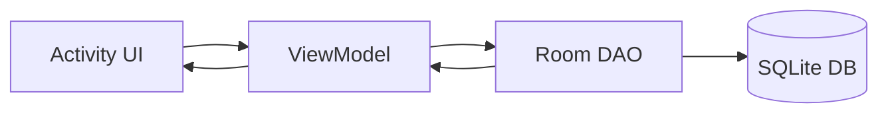

# ProjectWatchApp

Pocket Watch style budget tracker built with Kotlin, Activities, and Room.

## ViewModel section (completed)

The business-logic layer is implemented in six ViewModels:

- `UserViewModel` for registration/login, current user loading, and XP/level updates.
- `CategoryViewModel` for category add/list/delete logic and UI state.
- `ExpenseViewModel` for adding, listing, period filtering, totals, and delete.
- `BudgetViewModel` for monthly min/max goals, category budget caps, and status bands.
- `GoalsViewModel` for savings goal creation, deposits, and pinning.
- `RewardsViewModel` for badges and reward helpers.

All screens observe `StateFlow` from their ViewModel and keep DAO calls inside `viewModelScope`.

## Data safety and migrations

The app now uses an explicit Room migration from version 1 to 2:

- `MIGRATION_1_2` adds `expenses.photoPath`.
- Existing tables and rows are preserved.
- Destructive migration fallback has been removed.

This means user accounts and other existing local data are kept during the receipt-photo schema update.

## Budget status wiring

Budget status is now based on **actual monthly expenses** (from `ExpenseDao`) rather than allocated category caps:

- Green: spend < 80% of max goal
- Yellow: spend 80–100% of max goal
- Red: spend > 100% of max goal

## Quick architecture

## Tests added

- `BudgetViewModelTest` (unit test): validates monthly status bands and input validation.
- `AppDatabaseMigrationTest` (instrumented): validates `MIGRATION_1_2` adds `photoPath` and preserves existing expense rows.

## Submission summary (ready to paste)

For my section, I (Riba) completed and verified the ViewModel/business-logic layer across authentication, categories, expenses, budgeting, goals, and rewards. I implemented a non-destructive Room migration (`MIGRATION_1_2`) to add optional expense receipt support while preserving existing local data (no table wipe). I also improved budget logic to use live current-month expense totals for status calculations (green/yellow/red) instead of demo allocation values. Finally, I validated the work by running build, unit tests, and instrumented tests successfully (`assembleDebug`, `testDebugUnitTest`, `connectedDebugAndroidTest`).

## In-text citations (ready to use)

- ViewModel and lifecycle-aware UI state handling (`StateFlow`, `viewModelScope`) follow Android architecture guidance (Android Developers, n.d.a; Android Developers, n.d.b; Android Developers, n.d.c).
- Room entities/DAO patterns and SQL-backed local persistence follow official Room documentation (Android Developers, n.d.d; Android Developers, n.d.e).
- The non-destructive schema change from DB version 1 to 2 follows Room migration guidance (Android Developers, n.d.f).
- Build/test execution and Gradle command usage follow Gradle and Android command-line build documentation (Android Developers, n.d.g; Gradle, n.d.).
- Unit and instrumentation testing practices align with JUnit and Android testing references (JUnit Team, n.d.; Android Developers, n.d.h).

## Reference list (IIE Harvard style)

Android Developers. n.d.a. *ViewModel overview*. [online] Available at: <https://developer.android.com/topic/libraries/architecture/viewmodel> [Accessed 22 April 2026].

Android Developers. n.d.b. *StateFlow and SharedFlow*. [online] Available at: <https://developer.android.com/kotlin/flow/stateflow-and-sharedflow> [Accessed 22 April 2026].

Android Developers. n.d.c. *ViewModel with Kotlin coroutines*. [online] Available at: <https://developer.android.com/topic/libraries/architecture/coroutines> [Accessed 23 April 2026].

Android Developers. n.d.d. *Room persistence library*. [online] Available at: <https://developer.android.com/training/data-storage/room> [Accessed 23 April 2026].

Android Developers. n.d.e. *Accessing data using Room DAOs*. [online] Available at: <https://developer.android.com/training/data-storage/room/accessing-data> [Accessed 24 April 2026].

Android Developers. n.d.f. *Migrate Room databases*. [online] Available at: <https://developer.android.com/training/data-storage/room/migrating-db-versions> [Accessed 24 April 2026].

Android Developers. n.d.g. *Build your app from the command line*. [online] Available at: <https://developer.android.com/build/building-cmdline> [Accessed 25 April 2026].

Android Developers. n.d.h. *Test your app on Android*. [online] Available at: <https://developer.android.com/training/testing> [Accessed 25 April 2026].

Gradle. n.d. *Gradle User Manual*. [online] Available at: <https://docs.gradle.org/current/userguide/userguide.html> [Accessed 26 April 2026].

JUnit Team. n.d. *JUnit 4*. [online] Available at: <https://junit.org/junit4/> [Accessed 26 April 2026].

## Subsection in-text citations (mapped)

- **ViewModel section (completed):** (Android Developers, n.d.a; Android Developers, n.d.b; Android Developers, n.d.c)
- **Data safety and migrations:** (Android Developers, n.d.d; Android Developers, n.d.f)
- **Budget status wiring:** (Android Developers, n.d.e; Android Developers, n.d.d)
- **Quick architecture:** (Android Developers, n.d.a; Android Developers, n.d.d)
- **Tests added:** (Android Developers, n.d.h; JUnit Team, n.d.)
- **Build and verification commands in submission summary:** (Android Developers, n.d.g; Gradle, n.d.)

## Short reference list (exactly tied to code changes)

Android Developers. n.d.a. *ViewModel overview*. [online] Available at: <https://developer.android.com/topic/libraries/architecture/viewmodel> [Accessed 22 April 2026].

Android Developers. n.d.b. *StateFlow and SharedFlow*. [online] Available at: <https://developer.android.com/kotlin/flow/stateflow-and-sharedflow> [Accessed 22 April 2026].

Android Developers. n.d.c. *ViewModel with Kotlin coroutines*. [online] Available at: <https://developer.android.com/topic/libraries/architecture/coroutines> [Accessed 23 April 2026].

Android Developers. n.d.d. *Room persistence library*. [online] Available at: <https://developer.android.com/training/data-storage/room> [Accessed 23 April 2026].

Android Developers. n.d.e. *Accessing data using Room DAOs*. [online] Available at: <https://developer.android.com/training/data-storage/room/accessing-data> [Accessed 24 April 2026].

Android Developers. n.d.f. *Migrate Room databases*. [online] Available at: <https://developer.android.com/training/data-storage/room/migrating-db-versions> [Accessed 24 April 2026].

Android Developers. n.d.g. *Build your app from the command line*. [online] Available at: <https://developer.android.com/build/building-cmdline> [Accessed 25 April 2026].

Android Developers. n.d.h. *Test your app on Android*. [online] Available at: <https://developer.android.com/training/testing> [Accessed 25 April 2026].

Gradle. n.d. *Gradle User Manual*. [online] Available at: <https://docs.gradle.org/current/userguide/userguide.html> [Accessed 26 April 2026].

JUnit Team. n.d. *JUnit 4*. [online] Available at: <https://junit.org/junit4/> [Accessed 26 April 2026].
